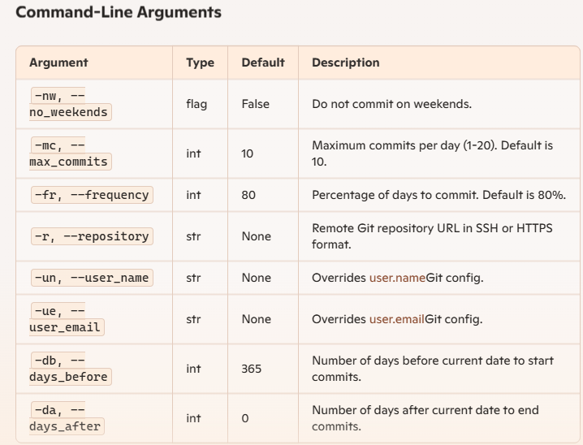

# Git Repository Automation Script

This script automates the creation of a Git repository, generates commit dates based on specified parameters, and optionally pushes the commits to a remote repository. It is designed to be scalable, maintainable, and readable.

## Prerequisites

- Python 3.6 or higher
- Git installed on your system
- Access to a remote Git repository (optional)

## Installation

1.  Clone this repository or download the script.
2.  Ensure you have Python and Git installed on your system.

## Usage

### Command-Line Arguments



### Example Usage

Run the script with the desired parameters:

bash

```
python git_repo_automation.py --repository https://github.com/yourusername/yourrepo.git --user_name "Your Name" --user_email "you@example.com" --days_before 30 --days_after 5 --max_commits 15 --frequency 90 --no_weekends

```

### Class and Function Documentation

#### Class: `GitRepository`

- `__init__(self, args)`: Initialize the GitRepository class with command-line arguments.
- `setup(self)`: Set up the Git repository, generate commits, and push to a remote repository if specified.
- `_determine_directory(self)`: Determine the directory name for the repository.
- `_create_and_initialize_repository(self)`: Create and initialize a new Git repository in the specified directory.
- `_generate_commit_dates(self)`: Generate a list of commit dates based on the specified parameters.
- `_contribute(self, date)`: Create a commit in the repository with the specified date.
- `_run_command(self, commands)`: Run a shell command and wait for it to complete.
- `_generate_commit_message(self, date)`: Generate a commit message based on the specified date.
- `_setup_remote_repository(self)`: Set up the remote repository and push the initial commits.
- `_contributions_per_day(self)`: Determine the number of contributions (commits) per day based on the specified parameters.

#### Function: `parse_arguments(argsval)`

- **Description**: Parse command-line arguments.
- **Arguments**:

  - `argsval (list)`: List of command-line arguments.

- **Returns**:

  - `argparse.Namespace`: Parsed command-line arguments.

Feel free to customize the script to suit your needs!
